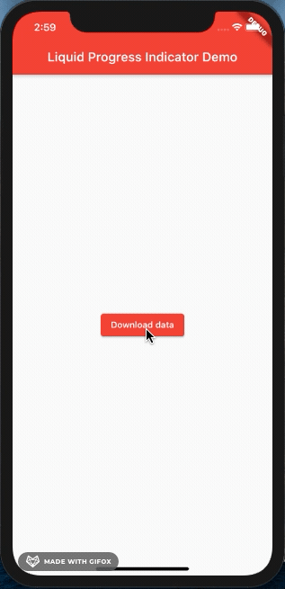

# liquid_progress_indicator demo

## Introducción

El objetivo del proyecto de este repositorio es realizar una demo de una librería de [Flutter](https://flutter.dev) que nosotros hayamos elegido para la PEC 5 de la asignatura **Nuevas tendencias en el desarrollo de aplicaciones móviles** del Máster de Desarrollo de Aplicaciones para Dispositivos Móviles de la UOC. En nuestro caso esa librería ha sido [Liquid Progress Indicator](https://pub.dev/packages/liquid_progress_indicator).

## ¿Por que es interesante?

Liquid Progress Indicator es una variante de los clásicos Linear o Circular Progress Indicator basado en un AnimationController.

Los indicadores de progreso son muy útiles cuando las aplicaciones tienen que realizar operaciones largas como descargar cantidades enormes de datos o realizar operaciones dificiles.

Esa es la razon por la cual hemos elegido esta librería, porque de esta manera la app mantiene un feedback con el usuario de una forma muy elegante, para evitar que el usuario piense que la app se ha quedado 'colgada'.

## Ejemplo

En este caso, cuando hacemos 'click' en el boton navegamos a una pantalla donde automaticamente comienza la descarga de unos datos 'falsos' (es un simple temporizador). Al terminar el proceso la app muestra los datos (un poema).

Los dos elementos ('liquid_progress_indicator' y el texto) estan dentro de un widget 'Visibility' en un StatefulWidet. Cuando el proceso termina cambiamos el estado de los dos elementos para ocultar uno y mostrar el otro.
